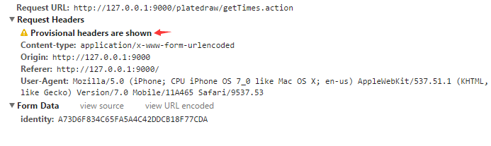

###0514笔记  

#### 1）atom-shell : GitHub开源的跨平台桌面应用框架  

基于nodejs和html5    
atom-shell的程序入口则是JavaScript脚本，而不是直接一个url，需要手动创建浏览器窗口，并通过相应的API加载html文件。  

#### 2) HBuilder : 完善代码提示和手机App开发 web工具

[官网](http://www.dcloud.io/)  
全面的语法库和浏览器兼容性数据。
手机真机联调。直接在真机上看效果，在HBuilder中保存代码更改，手机自动刷新界面。

#### 3) PhoneGap : 跨端APP开发接口

[官网]http://www.phonegap100.com/)
安卓app、苹果app、微信服务号、微信企业号、web app+其它轻应用

##### web app和native app对比
具体集合实际的业务需求和场景讨论  
native 速度体验较好，但是发布更新麻烦  
webapp体验差，但是发布更新全部自己控制  
因此web app比较适合做信息浏览类型的应用，对于功能
对于hybird app 中html5的比率会越来越大，native用来提供核心功能的流程体验  

1. Native的原生控件有更好的体验；
2. Native有更好的手势识别；
3. Native有更合适的线程模型，尽管Web Worker可以解决一部分问题，但如图像解码、文本渲染仍无法多线程渲染，这影响了Web的流畅性。

#### 4)jQuery Mobile

#### 6）ping不上的错误

