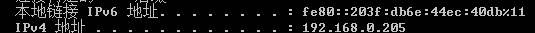

###0518笔记  

#### 1）git 合并冲突文件
	
	git checkout -- their ./
	git add -A
	git commit -m "0518"
	git push origin dev 

#### 2)提交时，页面下部分出现空白

  

该空白位置为键盘位置，因此： 
1）将body背景颜色设上部div颜色
2）同时 延迟弹出层的出现

#### 3）ipconfig 显示当前TCP、IP

这些信息一般用来检验人工配置的TCP/IP设置是否正常。

	ipconfig
当使用IPConfig时不带任何参数选项，那么它为每个已经配置好的接口显示IP地址

	ipconfig/all
显示DNS和WINS服务器显示它配置所有使用附加信息
IP地址（如果IP地址是DHCP服务器租用的，将显示DHCP服务）
物理地址（MAC）

	
