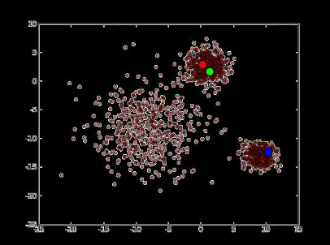
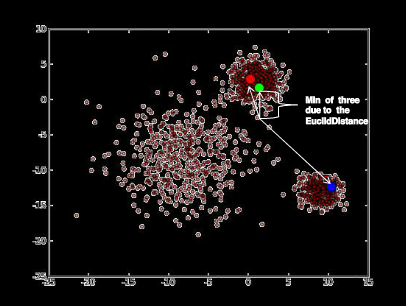
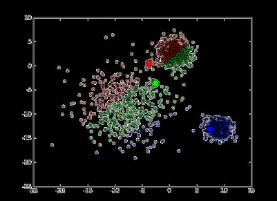
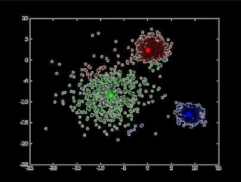
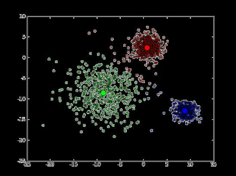

###K-Means聚束算法

#### 1）算法介绍
K-Means是一种基于距离的迭代式算法。  
将n个观察实例分类到k个聚类中，以使得每个观察实例距离它所在的聚类的中心点比其他的聚类中心点的距离更小。  

将每个观测实例都归类到距离它最近的聚类中心点，我们需要找到这些聚类中心点的具体位置。  

#### 2）算法过程

##### 1,取得K个初始中心点

##### 2,把每个点划分进相应的簇

##### 3,重新计算中心点

##### 4,迭代计算中心点

##### 5,收敛

* 1，从数据中随机抽取k个点作为初始聚类的中点，由这个中心代表各个聚类
* 2， 计算数据中所有点到这K个点的距离，将点归到离其最近的聚类里。
* 3， 调整聚类中心 ，即将聚类的中心一道几何中心（即平均值）处，也就是k-means中的mean的含义
* 4， 重复2，3步，知道聚类的中心不再移动，此时算法收敛。

#### 3)二分K-means算法
K-Means算法是基于原型的聚类技术，简单、快速并有效处理大规模数据。  缺点是存在过度依赖初始条件，如聚类数目K值的确定、初始聚类中心的选取以及数据的输入次序的变化等都会影响聚类结果，制约了其应用范围。  
二分K均值聚类算法是K-Means算法的变种算法，通过使用基本K-Means算法能够产生划分聚类算法或层次聚类算法，具有不受初始质心选择影响的优点。该算法在文本挖掘领域有着广泛的应用，通过优化算法的二分初始点的选择过程，把多次循环判断最优点改进为一次选择极大值点，提高了算法的整体运行速度，实验表明了算法的高效性
