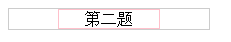
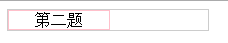
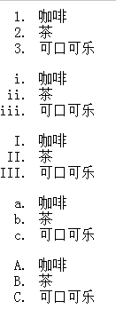
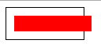
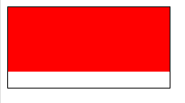

###0608笔记  

#### 1）已知这样一段HTML：

	

 
应用了这样一段CSS： 

	.a{ font:12px arial; } 
	p{ line-height:2; }
   
则这个p元素的line-height值是（    ）  
normal

#### 2) 已知HTML如下： 

	

 
 
已有CSS如下：

	.a{ width:200px; }
	.b{ width:100px; } 
 
请问，再增加以下哪个CSS可以使得这个宽为100px的span元素在它的父元素里水平居中（    ）
请选择一个选项

	.a{ text-align:center; }  .b{display:inline-block; } 
效果：
 

	.b{display:inline-block; text-align:center; }
效果：
 

#### 3） 已知HTML如下：

 
 
已有CSS如下： 

	.arrow{       
    	 width:0; height:0; border:5px solid #000;
	} 
 
请问，再增加以下哪个CSS可以实现一个向下的箭头（    ）

	.arrow{border-color:#000 transparent transparent;}

#### 4）

 默认情况下，有序列表的序号是从1开始的，通过以下哪个属性可以改变开始序号（）begin

	start
	begin
	type
	index
对于type：

	ol.decimal {list-style-type: decimal;list-style-index:2}
	ol.lroman {list-style-type: lower-roman}
	ol.uroman {list-style-type: upper-roman}
	ol.lalpha {list-style-type: lower-alpha}
	ol.ualpha {list-style-type: upper-alpha}
效果对应如下：  

[比较有趣的列表例子](http://www.codefans.net/jscss/code/3434.shtml)

#### 5）已知HTML如下：

	

文字

 
 
已有CSS如下：

	.a{font-size:12px; line-height:200%;} 
	.b{font-size:16px;} 
 
请问p元素最终的行高为：（）24px

#### 6）以下代码执行后a,b的值分别是（）

	var a=0;
	var b=!{}?1:a++&&a++;
1，0

解析：
!{} ===>false ,同时 ，a++&&a++只执行&&中第一个a++

#### 7）以下代码执行时两个alert分别输出值是（）

	var a=1;
	(function(){
    	alert(a);
    	var a=2;
    	alert(a);
	})();

undefined, 2

#### 8）以下代码执行后president.name的值是
	(function(callback){  
    	president ={name:"bush"};  
    	callback(president); 
	})(function(obj){    
    	obj.name ="obama";    
    	obj ={name:"clinton"}; 
	})

“obama”

#### 9）以下代码执行时alert输出值是（ ）
	var x=0; 
	function foo(x){    
     	x++;    
     	this.length=x;    
     	return foo; 
	} 
	var bar =new new new foo; 
	alert(bar.length);
1

#### 10）以下代码执行时alert输出值分别是 

	var foo={    
       bar:function(){        
            alert(this);    
       } 
	 }; 
	(foo.bar)();
	(foo.bar,foo.bar)(); 
	(foo.bar=foo.bar)();

foo,window,window

#### 11）已知这样一段HTML：
	

 
应用了这样一段CSS： 
	.a{ width:100px; padding:10px; box-sizing:border-box; } 
	.b{ width:100%; padding:10px; background-color:red; } 
 
请问，你看到的红色区域的宽度有多大（      ）
100px

#### 12）已知HTML：
	

 
如果应用了如下CSS： 

	.a{ width:200px; height:100px;} 
	.b{ padding:20%; background-color:red; } 
 
那么红色区域的大小是（）

宽：200px，高：80px

#### 13）以下代码执行时两个alert分别输出值是 
	var A=1; 
	(function A(){       
    	A=2;       
    	alert(A);       
    	delete A;       
    	alert(A); 
	})();

函数A,函数A

#### 14）表达式 []+(-~{}-~{}-~{}-~{})+(-~{}-~{}) 的运算结果是

“42”

#### 15）. 以下代码执行时alert输出值分别是 
	var o={   
      x: 10,   
      foo: function () {       
             with (this) {            
                    function bar() {                 
                         alert(x);                 
                         alert(this.x);            
                    }             
                    var x=20;          
                    (function() {                      
                          bar();                 
                    })();         
                    bar.call(this);       
              }   
       } 
	} 
	o.foo();

undefined,undefined,undefined,20