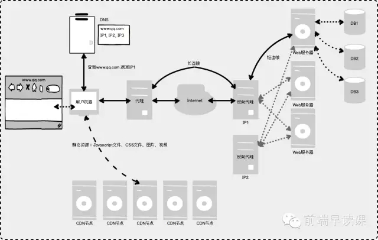
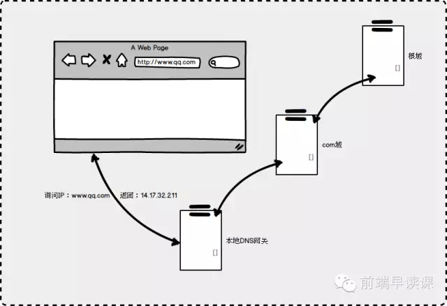
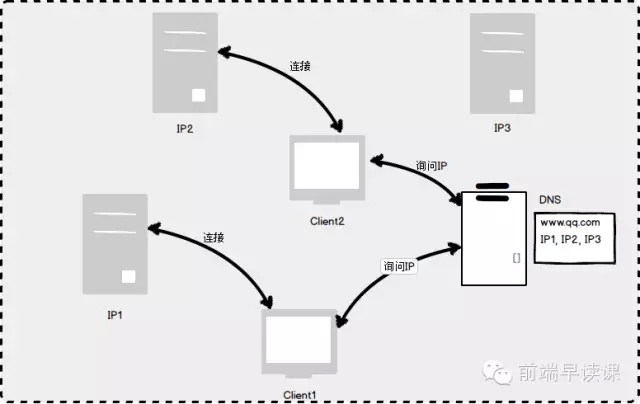

###0615笔记  

#### 1）经典的Web应用网络模型

经典的前端面试题，在地址栏中输入某个网址，简要讲下整个页面呈现的过程  
常见的web应用基本过程和网络模型

用户输入链接http://www.qq.com之后浏览器需要找到域名所对应的IP地址，因为计算机是通过IP作为门牌号，而域名是IP地址的别名。  
浏览器会先询问本地DNS缓存，如果没有记录这个域名映射的IP，就会向本地的DNS网关询问，网关也不知道就会向上一级DNS服务器询问，直到找到对应的IP地址。

  

一台服务器处理请求是有限的，因此大型的应用会有多台proxy机器，我们可以让DNS服务器在第一个请求返回IP1，第二个请求返回IP2，。。这样用户的请求将会均匀落在这些服务器上，这就是DNS负载均衡。  
CDN就是通过智能DNS算出离用户最近的CDN节点的IP地址，这样用户可以访问一台离他最近的机器，大大节约连接时间。

 

#####代理与反向代理 

大部分的公司都会内部的计算机都配置了代理服务器，其作用是所有内部的网络请求都是通过代理去连接对方服务器，可以在代理服务器这里做恶意请求/响应的拦截，还可以缓存内部网络所需的公共资源。  
反向代理就是以代理服务器来接收网络连接请求，我们上下文称Proxy机器指的就是反向代理机器，Proxy机器收到请求后会经过一定的分析最后把请求内容转发给内网对应的Web服务器，Web服务器的HTTP响应包会先到Proxy机器，然后再到用户机器。  

反向代理的好处是可以负载均衡，在它后边可以有多台工作的Web服务器，这样分层次之后，很多职责就明确很多了：Proxy机器负责负载均衡、拦截恶意请求、维持长连接，还可以屏蔽不工作的Web服务器；而Web服务器就只要关心自己处理的Web业务逻辑即可。 
往往Proxy服务器跟用户机器保持长连接，这样可以节省用户每次跟服务器建立连接的消耗，而Proxy服务器跟Web服务器采用短连接的方式，这样可以有效节约Web服务器的资源。

#####Web server
Web server的职责就是根据用户的请求，返回其所需要的响应内容。往往Web server只涉及业务测逻辑的判断以及数据的组装，而真正的数据位于后端的存储Server(本文不涉及)。  

对于一般应用来说，Web server返回的是动态产生的内容（每个用户都不一致的动态内容或者经常编辑变动的内容），如页面的HTML内容、JSON数据、XML数据等。而Javascript文件、CSS文件、图片这些静态资源（不根据用户而变动的资源）往往存放在CDN中。